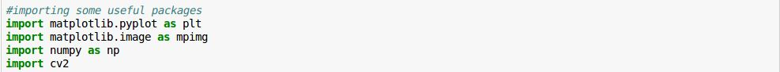
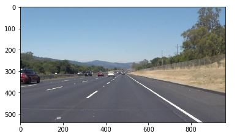
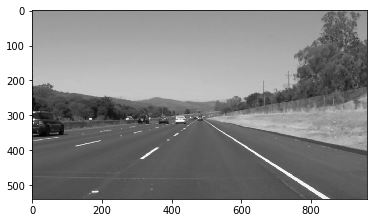
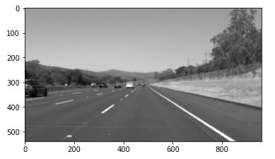
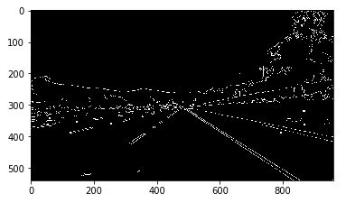
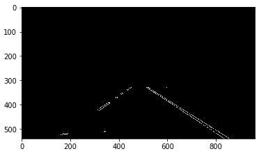
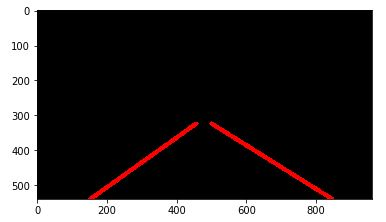
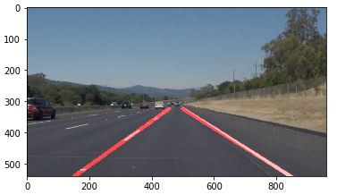

# **Finding Lane Lines on the Road** 

**The goal of the project is to detect lanes on the road in an image at first and then a video and overlay the image frames with the marked lanes. The lanes detected is averaged and extrapolated to form a single left and right lane instead of multiple segments.**

Python and OpenCV was used in this project to build a pipeline model in Jupyter Notebook environment.

---

## Pipeline Steps:
1.	Import packages 
The following packages have to imported for the project to work

2.	Read in source image 
The source image is read and stored in “image”

3.	Convert source image into grayscale image 
The source image is converted into grayscale because the edge detection algorithm works on grayscale to measure the gradient.

 
4.	Apply Gaussian blur on the gray image  
It is important to blur the image before Canny even though it has an inbuilt smoothing because the result may not be satisfactory with just the inbuilt blur kernel. Smoothing or blurring the image removes noisy edges which can significantly improve the edge detection output. In this project a Gaussian blur kernel of 7 is used.

5.	Apply Canny transform to obtain edges 
The Canny algorithm detects edges based on the thresholds passed in to the function. If the gradient is less than the lower threshold, it is not considered as an edge whereas if the gradient is greater than the higher threshold, it is takes an edge In this project, the lower threshold is set to 40 and the higher threshold is set to 80. It is recommended that the lower threshold : higher threshold ratio be 1:2 or 1:3.

6.	Mask the output image to region of interest 
As seen from the above output from the canny transform, we get a lot of edges including the trees and other vehicles on the sides. In this step, we constrain our region of interest to a specific area on the road to reject all the unwanted edges. A mask is created to produce a binary image with only the edges in the region of interest.

7.	Apply Hough transform to detect lines 
The image from above is now passed to Hough transform to detect all the lines based on the following input parameters:
a.	rho = 1
b.	theta = 1 deg
c.	threshold = 15
d.	min_line_len = 10
e.	max_line_gap = 20
All the above values are obtained using a trial and error method to produce a satisfactory result.

8.	Average and Extrapolate the lines 
The lines obtained from the hough function is a set of (x, y) points. Our aim is to average all the slopes of lines and x-intercept terms detected on the left lane and the lines detected on the right lane. We differentiate the (x, y) points on whether they belong to left or right lane based on the slopes. The left lane slanted towards the right will have a negative slope whereas the right lanes slanted to the left will have a positive slope. 
After calculating the average slopes and the x-intercept terms for the left and right lanes, we find the end points or the x coordinates and y coordinates for the lines we need to draw. The y coordinates of the lines are fixed so that the line extends from the bottom of the frame to almost center of the frame. The functions draw_lines and avg_slope_intercept implement the above calculations.

9.	Overlay the lines drawn on the source image 
Now that the line image is obtained, we overlay this image using bitwise AND operation with the source image to get the desired final output.

10.	Save the final image 
The final output image is saved to the test_images directory

## Challenges

1.	Adding weights to slope calculation  
The average and interpolation step above is sensitive to noises or other unwanted lines that is found in the region of interest. This can be caused by shadows or other road markings. This happens because the averaging function takes into account the slope of the unwanted lines and shifts the average slope of the final line towards this direction.  
In order to avoid this, we calculate the length of the lines and calculate a weighted average of the slopes and intercepts. In this way, the noisy lines or other unwanted markings gets a lower weight as compared to the actual lane markings.

2.	Curve roads 
The above pipeline works great for straight lines. However, it was found that this is true only when the region of interest has stronger edges or lines compared to unwanted edges. When the project was compiled for the curve road in the challenge question, the region of interest covered the road median strip which had an equally strong edge compared to the lane marking. The final lines obtained was all over the place due to the lines detected on the road median. 
Thus the pipeline was modified for the challenge question to detect edges only of white and yellow color which reject any unwanted edges that came in the region of interest. The RGB image was converted to HSL space to threshold yellow and white color. The threshold values were set using the color picker from the website www.w3schools.com/colors/colors_hsl.asp

3.	Region of interest selection 
It was found that the video feed from the challenge question was at different resolution and at a different mounting angle since the hood of the car was visible. Therefore hard setting the vertices for the region of interest would vary depending on the image resolution. To solve this issue, the source image after reading in is resized to the resolution of 960 x 540 pixels so that the vertices need not be updated depending on the resolution.

## Conclusion

The basic lane detection project was successful in detecting lanes on an image as well as in the video in both straight and curved roads. Detecting lanes in curved roads included color based selection of lanes to reject unwanted edges occurring in the region of interest. Averaging of slopes and intercepts of left and right lines were done using a weighted average to reject noises or unwanted markings which shifted the average line. A possible improvement would be to fit curved lines on to the lanes instead of just a straight line. 
The final output videos are included in the test_videos_output directory and the output image is in test_images directory

